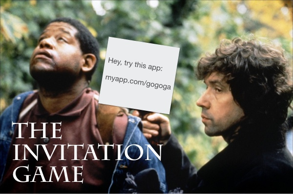

# The Invitation Game

API for a gamified invitation system built in Node.js.

## How to Run

Just start with:

	export APP_NAME="My Website" # Set App Name
	export APP_DESCRIPTION="My Website is the best website." # Set App Name
	export DESTINATION=http://www.mywebsite.com # Set default Destination (when Invitee clicks the link)
	export SEND_INVITE_URL=http://www.mywebsite.com/invite-a-friend # Set URL for where to send invite (for the Inviter)
	export ACCEPT_INVITE_URL=http://invites.mywebsite.com # Set URL for where to accept invite (for the Invitee)

	# If you want email using Amazon SES
	export EMAILSENDER="Email Sender <info@mywebsite.com>"
	export SES_ACCESSKEY=[your key]
	export SES_SECRET=[your secret]
	export SES_REGION=eu-west-1

	grunt

Server will default to **http://localhost:3011**

## How to Test

	npm test

## How to Use

### 1) Create invitation

Generate a unique invitation code based on Inviter (+ Destination):

	curl -X POST -H "Content-Type: application/json" -d '{ "email": "inviter@weld.io", "name": "Ellie Arroway" }' http://localhost:3011/api/invites

Fields:

* `email` **(required)**: the Inviter’s email (is stored in database).
* `name`: the Inviter’s name (is stored in database).
* `destination`: if you want to override the default Destination URL, specify URL here.

JSON response:

	{
		"_id": "56c97aeba74d62b6e1895175",
		"code": "bo",
		"user": "56c8df5215e12e53e0c77bba",
		"destination": "https://www.weld.io",
		"__v": 0,
		"dateCreated": "2016-02-21T08:52:59.638Z"
	}

**Note:** The invitation code is generated with simple syllables. Code 0="ba", 1="be", 1000000="bebababa", etc.

### 2) Distribute link

Let the Inviter distribute the link `http://localhost:3011/[code]` via email, SMS, or copy link.

You can also tell Invitation Game to send an email invitation:

	curl -X POST -H "Content-Type: application/json" -d '{ "code": "bo", "message": "You should really try this app:", "email": "invitee1@weld.io,invitee2@weld.io" }' http://localhost:3011/api/email

Fields:

* `code` **(required)**: the Invite code.
* `message`: used in the message to the Invitee.
* `email`: Comma-separated lists of 1+ email addresses to invite, e.g. `invitee1@weld.io,invitee2@weld.io`. Invitee email addresses *are never* stored in the database.

### 3) Link is clicked

Invitee clicks the link and is transported to _Destination_ with optional parameters. `inviteCode` is added to URL parameters.

### 4) Create confirmation

When Invitee signs up, confirm this to by using the `code` provided. Score is added to Inviter. Email is sent to Inviter.

	curl -X POST -H "Content-Type: application/json" -d '{ "code": "bo", "email": "invitee@weld.io" }' http://localhost:3011/api/confirmations

Fields:

* `code` **(required)**: the Invite code.
* `email` **(required)**: the Invitees email address. Invitee email addresses *are never* stored in the database.

JSON response:

	{
		"confirmations": {  
			"6f6a3e6c75de042f115f97aef6d7b537": {  
				"date": "2016-08-12T07:57:11.502Z"
			}
		},
		"_id": "56c97aeba74d62b6e1895175",
		"code": "bo",
		"user": "56c8df5215e12e53e0c77bba",
		"__v": 0,
		"dateCreated": "2016-02-21T08:52:59.638Z"
	}

### 5) Trigger rewards

Inviter’s score is accumulated, and rewards can be triggered at certain score levels. Rewards can be trigger web callbacks and/or email being sent.

`rewards` collection in MongoDB:

	/* For Inviter */
	{
		"recipient": "inviter",
		"score": 1,
		"description": "One free month of My Website.",
		"claimInstructions": "Use discount code INVITED1 at www.mywebsite.com/upgrade"
	}
	{
		"recipient": "inviter",
		"score": 3,
		"description": "Three free months of My Website.",
		"claimInstructions": "Use discount code INVITED3 at www.mywebsite.com/upgrade"
	},

	/* For Invitee */
	{
		"recipient": "invitee",
		"description": "One free month of My Website.",
		"claimInstructions": "Use discount code WASINVITED at www.mywebsite.com/upgrade"
	}

## Implementation

Based on the [Yeoman Express generator](https://github.com/petecoop/generator-express) with the "MVC" option.
Built on Node.js, Express (with EJS) and MongoDB.

## Deploying on Heroku

	# Set up and configure app
	heroku create MYAPPNAME
	heroku addons:add mongolab
	heroku config:set NODE_ENV=production
	heroku config:set APP_NAME=[...]
	heroku config:set APP_DESCRIPTION=[...]
	heroku config:set DESTINATION=[...]
	heroku config:set SEND_INVITE_URL=[...]
	heroku config:set ACCEPT_INVITE_URL=[...]

	heroku config:set EMAILSENDER=[...]
	heroku config:set SES_ACCESSKEY=[...]
	heroku config:set SES_SECRET=[...]
	heroku config:set SES_REGION=[...]
